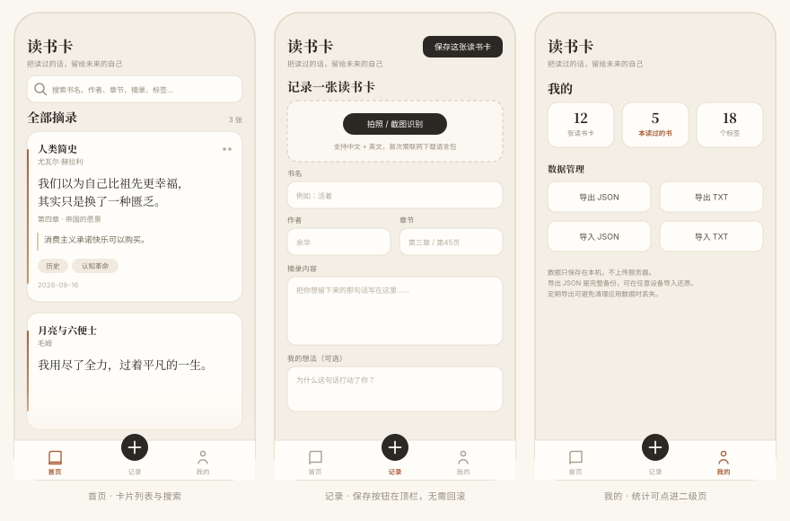

# 读书卡

> 把读过的话，留给未来的自己。

一个只做一件事的应用：**把书里划下来的句子，做成一张留得住的卡片。**

纯静态网页实现全部功能，外面套一层 Android WebView 外壳。没有框架、没有构建步骤、没有服务器、没有账号——**数据只存在你自己的手机里**。




> 上图为按实际 CSS 变量绘制的界面示意。真机截图欢迎补充到 `docs/screenshots/`。

---

## 功能

| 功能 | 说明 |
|---|---|
| **记录读书卡** | 书名 / 作者 / 章节 / 摘录 / 想法 / 标签 / 封面，封面可后补 |
| **OCR 摘录** | 拍书页或截图，自动识别中英文文字填入摘录框（Tesseract.js） |
| **分享卡片图** | 把摘录渲染成 1080 宽的图片，直接分享到微信、微博等，或存进相册 |
| **分享纯文字** | 只发文字时走系统分享面板，失败自动降级到剪贴板 |
| **搜索** | 书名、作者、章节、摘录、标签全文匹配 |
| **书架** | 按书聚合，看一本书里留下了多少句 |
| **统计** | 卡片总数、涉及书目、标签分布 |
| **导入 / 导出** | JSON（完整备份，含封面）与 TXT（纯文本，方便粘贴进笔记软件）双向 |
| **离线可用** | 除 OCR 首次加载语言包外，全部功能不联网 |

界面上刻意做得安静：暖白纸色、衬线字、卡片左侧一道渐变书脊。没有打卡、没有连续天数、没有推送。

## 安装

### 方式一：装到手机

从 [Releases](../../releases) 下载 `读书卡-v*.apk`，传到手机点击安装。

- 系统要求 **Android 8.0（API 26）及以上**
- 安装时如提示「未知来源应用」，允许即可
- 应用**只申请一项权限**：`INTERNET`（出于 OCR 需要），普通权限、装机自动授予，不会有权限弹窗

> **小米 / 红米用户注意**：安装过程中可能看到「已拒绝此应用获取敏感权限」。这句话来自 MIUI / 澎湃 OS 对非应用商店来源应用的通用拦截，**与本应用实际申请的权限无关**——包里除了联网没有任何权限可拒。提示之后安装照常完成。若确实装不上，依次尝试：关闭「设置 → 应用设置 → 纯净模式」→ 给「安装未知应用」授权 → 弹窗里手动选「继续安装」→ 或改用 `adb install -r 读书卡.apk`。

### 方式二：直接用网页版

`index.html` 本身就是完整应用，浏览器打开即可（手机上还能「添加到主屏幕」当应用用）。

```bash
npm run serve      # http://localhost:8080
```

> 建议走本地服务而不是直接双击文件。`file://` 协议下 OCR 需要拉取的 worker 与语言包常被浏览器拦截。

网页版数据存在浏览器 localStorage 里，和手机 App 的数据互不相通，可用「导出 / 导入 JSON」搬运。

## 项目结构

```
.
├── index.html                  ← 全部业务逻辑（HTML + CSS + JS 单文件）
├── index.original.html         ← 最初的版本快照，可对照改动
├── smoke-test.js               ← jsdom 冒烟测试（桥接模式 / 浏览器模式）
├── build-apk.sh                ← 一键重建 APK
├── package.json
├── android/                    ← Android 外壳工程（Kotlin + WebView）
│   ├── app/src/main/java/com/debugmh/bookcard/MainActivity.kt
│   ├── app/src/main/assets/index.html   ← 构建时从根目录同步过来
│   ├── keystore.properties.example      ← 签名配置模板
│   └── gradlew / gradle/                ← Gradle Wrapper
├── tools/
│   ├── serve.js                ← 本地静态服务器
│   └── check-restore.js        ← 单点回归脚本
├── docs/preview.svg
├── APK打包说明.md               ← 构建细节、改动记录、踩坑
├── CHANGELOG.md
└── LICENSE
```

**架构上只有一条规则**：根目录的 `index.html` 是三端（网页 / Android / iOS）唯一的业务载体，外壳只负责提供原生能力，不含业务逻辑。改功能只改这一个文件，构建脚本会自动同步进 `assets/`。

## 构建 APK

### 环境要求

- JDK 17
- Android SDK，含 `platforms;android-34`、`build-tools;34.0.0`

```bash
sdkmanager "platforms;android-34" "build-tools;34.0.0"
```

脚本会自动探测 `JAVA_HOME` / `ANDROID_HOME`，找不到时会去常见安装位置（Android Studio 自带 JBR、各平台默认 SDK 路径）里翻，必要时自动生成 `android/local.properties`。

### 出调试包（无需签名配置，先跑起来用这个）

```bash
bash build-apk.sh debug
```

### 出正式签名包

```bash
cp android/keystore.properties.example android/keystore.properties   # 填入自己的签名信息
bash build-apk.sh                # 默认即 release
```

`keystore.properties` 与 keystore 文件本体都已在 `.gitignore` 中。**没有它时 release 无法构建**——因为不配签名 Gradle 只会产出未签名包，装到手机上报「解析包时出现问题」，属于闷声出错，所以脚本会直接拦住并提示。

> ⚠️ **keystore 弄丢 = 以后所有更新都装不上。** 同一个包名的后续版本只能用同一个签名，换签名老用户必须先卸载、数据清空。请把 keystore 与密码一起妥善备份。

### 全自动构建

`.github/workflows/ci.yml` 会在每次 push / PR 时跑冒烟测试并编译调试包，产物在 Actions 的 Artifacts 里。

## 测试

```bash
npm install                       # 需要 Node 22.22.2 及以上
npm test                          # 两种模式连跑
node smoke-test.js                # 桥接模式：模拟 APK 内的原生桥接环境
node smoke-test.js --no-bridge    # 浏览器模式：无桥接，验证降级路径
```

测试用 jsdom 把 `index.html` 整个跑起来，然后按真实用户路径操作 DOM：建卡、改卡、删卡、撤销、搜索、导入导出、分享。断言约 90 项，覆盖功能之外还守着几个历史的坑：

- 撤销删除后**整体顺序**必须与删除前逐项一致，而不是仅仅条数复原
- 「恢复示例数据」不得污染原始数组（历史 bug：`data` 与 `samples` 是同一个引用）
- 分片传输的 base64 逐片校验，拼接结果必须与原文逐字节相等
- 断言本身不能恒真——曾出现过 `indexOf` 比较对象引用、两侧恒为 `-1` 而"永远通过"的假测试

## 技术要点

单文件网页 + 薄外壳，看起来简单，真正花时间的是几个**静默失败**的坑。这些在 `APK打包说明.md` 里有更详细的记录。

**OCR 必须跑在 HTTPS 源下。** 本地页面默认用 `file://` 加载，其源为 `null`，此时 Tesseract.js 拉 worker、wasm、语言包的跨域请求会被 Chromium 全部拦掉，用户侧只看到"识别失败"。解法是用 `WebViewAssetLoader` 把本地页面挂到 `https://appassets.androidplatform.net/` 下，拿到正常源。

**大字符串过桥必须分片。** 1080 宽的卡片图 base64 常达 1–3MB，一次性作为参数传给 `@JavascriptInterface` 会被 IPC 静默丢弃——不抛异常、不回调，表现就是「点了按钮没反应」。改为 64KB 一片，`beginImage(total)` → `pushImagePart(i, chunk)` → `saveImageDone()` 累积，缺片显式报错。

**分享图片不需要任何存储权限。** Canvas 出 PNG → 分片送原生 → `FileProvider` 以 `content://` 交给微信读取，权限面只开放 `cache/images/`。存相册走 `MediaStore` + `IS_PENDING`。全程零存储权限。

**WebView 里 localStorage 可能不可靠**，安卓侧靠 `allowBackup="false"` + 应用私有目录，导入导出始终提供 JSON 兜底。

**吸顶元素要用 `position: sticky` 而不是 `fixed`**——sticky 随所在容器一起显隐，切页自动消失，不用写 JS 控制。

## 数据与隐私

- 所有读书卡存在设备本地，**不上传任何服务器**，没有账号体系
- 应用只有一项网络权限，且仅被 OCR 使用（Tesseract.js 从 jsDelivr CDN 加载，首次识别需下载中英文语言包，合计约 30MB）
- 分享图片、导出文件都经系统分享面板，由你决定发给谁
- 卸载应用会一并清除数据，**升级或换机前先导出 JSON**

## 常见问题

<details>
<summary>OCR 一直在转圈 / 提示识别失败</summary>

首次识别要下载约 30MB 语言包，网络慢时会等较久。确认：① 设备能正常访问 `cdn.jsdelivr.net`；② 在 App 内使用（网页版需通过 http/https 打开，不能是 `file://`）。失败时不会丢数据，手动把文字粘进摘录框即可。
</details>

<details>
<summary>换了新手机，数据怎么搬</summary>

旧机「我的 → 导出 JSON」→ 把文件传过去 → 新机「我的 → 导入 JSON」。JSON 是完整备份，含封面图；TXT 是纯文本，适合贴进笔记软件。
</details>

<details>
<summary>为什么装新版提示「应用未安装」</summary>

签名不一致，安卓不允许覆盖。多见于早期 debug 包与现在的正式包之间。处理方式：先在旧版导出 JSON，卸载，装新版，再导入。
</details>

<details>
<summary>为什么不打包成 iOS 应用</summary>

网页部分本身跨平台，iOS 只需一个 WKWebView 外壳。Windows 上无法编译 ipa，需要 macOS + Xcode。有 Mac 的话外层壳很薄，可以直接照着 `MainActivity.kt` 的桥接方法实现一遍。
</details>

## 参与

欢迎提 Issue 和 PR。动手前建议先跑一遍 `npm test` 确认基线是绿的。

改动集中在 `index.html` 一个文件里，注意两点：CSS 变量定义在 `:root`，改样式优先复用它们；所有原生能力都要有浏览器降级路径（`window.AndroidBridge` 不存在时的分支），否则网页版会坏掉。

## 许可

[MIT](LICENSE)
